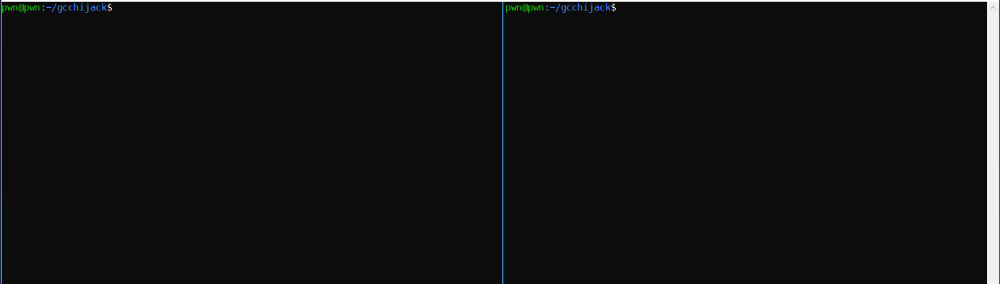

# gcchijack
A PoC tool to backdoor binaries compiled by gcc/g++ by hijacking their temporary files.

## How it works
When gcc and g++ compile source to a binary, they first write the generated assembly to a temporary file (usually `/tmp/<random_string>.s`). The compiler then invokes the GAS assembler to assemble this file into an object file, e.g. with `/usr/bin/as --64 -o /tmp/ccKdFjq0.o /tmp/ccQIzZ3y.s`. 

Therefore it is possible for us to modify the generated assembly to insert our own code before the assembler has been invoked, if we do it quickly. This project achieves this by setting up an inotify watch on `/tmp/`, then when any `.s` files are created the code will open them, if `main:` is found then an assembly snippet will be inserted directly after it.

## Disclaimer
This is a quick hack which doesn't do anything too exciting. If you want to do something more exciting or target a binary which isnt x86_64 then just change the backdoor assembly snippet at the top of the file.
